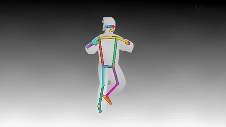

# mocap-control-kit

Build pose+depth control videos for AI video models (LTX-2.3, Wan-VACE, and friends). The control video carries the motion and the 3D of the scene; the model does the skinning, lighting, and wardrobe. You keep the performance.

## Two ways in

**1. From real footage (the main lane).** Point it at any clip with a person in it. It pulls **depth from the scene** and **pose from the actual person in frame** — both extracted from the same video — and composites them into one combo control. Feed that to a union/multi-condition model and it re-skins that exact person into anyone while their real motion, real 3D volume, and real occlusion stay intact. No mocap suit, no green screen, no set. Everything runs locally.



*`combo.mp4` extracted from a single clip of one performer — the depth mask carries the 3D, the skeleton carries the motion, both pulled from the same frames.*

```bash
pip install -r python/requirements.txt   # torch, transformers, mediapipe, opencv
python3 python/extract_controls.py --video in.mp4 --outdir controls/
# → controls/depth.mp4, controls/pose.mp4, controls/combo.mp4
```

Hand `combo.mp4` to LTX-2.3 IC-LoRA Union-Control (the one we tested) with a prompt describing the character and world. Details and tuning in [From your own videos](#from-your-own-videos) below.

> Tracking quality is shot quality: one clear, full-body subject tracks cleanly frame for frame. Distant, tiny, or crowded subjects are harder — the bundled MediaPipe model locks one person at a time.

**2. From joint data (synthetic lane).** If you already have motion as joints — a physics sim, retargeted mocap, a procedural gait — a single static Go binary renders it to the same control format with no ML stack, `ffmpeg` the only dependency. Covered under [Quickstart](#quickstart).

## Pose and depth in one control video

Pose skeletons tell a video model where the limbs are but nothing about the world. `-depth-combo` fixes that with zero extra passes: since the source data is 3D, the renderer draws true geometric depth (a shaded ground plane receding in quantized bands, plus depth-shaded thick bones) *underneath* the colored skeleton. One video, two control channels. Models that accept union/multi-condition control (LTX-2.3 IC-LoRA Union-Control is the one we tested) read both at once: the skeleton drives the body, the grayscale depth drives camera perspective and world layout.

The side effect worth knowing about: because the ground shading is quantized into bands, models interpret the luminance steps as geometry. Depth bands render as stairs, terraces, or floor seams depending on the style prompt. You can sculpt world structure by editing a grayscale gradient. Treat the depth layer as a level editor.

## Quickstart

```bash
go install github.com/walter-grace/mocap-control-kit@latest
# installs a `mocap-control-kit` binary; alias it or rename to `mocap-control`

# 1. synthesize a walk cycle (no mocap files needed)
mocap-control-kit sample -out walk.json.gz -dur 4 -style walk

# 2. pose-only control video
mocap-control-kit -dur 4 -dist 1.6 walk.json.gz walk_pose.mp4

# 3. pose + depth in one control video
mocap-control-kit -dur 4 -dist 1.6 -depth-combo walk.json.gz walk_combo.mp4
```

Then send `walk_combo.mp4` to your video model as the control/reference video with a prompt describing the character and world.

### Build from source

```bash
git clone https://github.com/walter-grace/mocap-control-kit
cd mocap-control-kit
go build -o mocap-control .
```

Pure stdlib — no Go dependencies to fetch. Cross-compile with the usual `GOOS`/`GOARCH`.

## Motion format

A gzipped JSON object:

```jsonc
{
  "fps": 30,                  // sample rate of pos
  "parents": [-1, 0, 1, ...], // parent joint index per joint, -1 = root
  "pos": [                    // [frames][joints][3] world-space positions, meters
    [[x, y, z], ...],         // Z-up (MuJoCo convention): x/y ground, z height
    ...
  ]
}
```

Any skeleton topology works; the renderer just draws parent→child bones. The bundled sample generator and the bone-width table use a 23-joint layout (pelvis, 3 spine, neck, 2 head, 4 per arm, 4 per leg) with parents `[-1,0,1,2,3,4,5,3,7,8,9,3,11,12,13,0,15,16,17,0,19,20,21]`. If your data is Y-up, swap axes before export (`pos_zup = pos_yup[:, :, [0, 2, 1]] * [1, -1, 1]`).

The `sample` subcommand is also the reference exporter: it produces a valid file from pure math. Port its output block to dump motions from your own pipeline.

## Camera dials

Framing is the generation's framing doctrine: video models compose the shot the control video composes. Set the shot here, not in the prompt.

| Flag | Env var | Default | What it does |
|---|---|---|---|
| `-dist` | `SKEL_DIST` | 2.1 | Camera distance as a multiple of figure height. 1.25 = medium-full (character work, faces), 2.1 = wide (choreography, travel). |
| `-height` | `SKEL_HEIGHT` | 0.35 | Camera height as a multiple of figure height. Lower = heroic low angle. |
| `-damp` | `SKEL_DAMP` | 1.0 | Follow-cam lerp. 1.0 hard-locks to the hips; 0.08–0.15 gives cinematic lag and kills hip-jolt shake on violent motions. |
| `-static` | `SKEL_STATIC` | off | Lock the camera at its first-frame position; the figure moves through frame. |
| `-inplace` | `SKEL_INPLACE` | off | Treadmill mode: cancel hip XZ travel per frame. See recipe below. |
| `-depth-combo` | `SKEL_DEPTH_COMBO` | off | Render geometric depth (ground bands + depth-shaded bones) under the skeleton. |
| `-fps` | `SKEL_FPS` | 24 | Output frame rate. |
| `-frames` | `SKEL_FRAMES` | 0 | Exact output frame count. Past the end of the motion the renderer pingpong-loops, so you can hit model-required frame counts from any clip length. |
| `-start` / `-dur` | — | 0 / 5 | Source-motion start time and clip duration, seconds. |
| `-w` / `-h` | — | 832×480 | Output resolution. |

Env vars are fallback defaults (handy in pipelines); CLI flags win.

## Driving LTX-2.3 Union-Control and Wan-VACE

- **LTX-2.3 IC-LoRA Union-Control**: pass the combo video as the control input. Keep output resolution a multiple of 64 per side (the IC-LoRA requires it); the default 832×480 render works as-is. Use `-frames` to match the model's expected frame count.
- **Wan-VACE**: pass the pose-only render as `src_video`. VACE reads the OpenPose color coding directly. For multi-character scenes use `-multi` (below) so all characters share one camera.
- Anything pose-conditioned: the skeleton is plain OpenPose-style colored sticks on black, which most pose ControlNets and pose LoRAs accept without preprocessing.

Prompt for the world; the control video already owns the body and the camera.

## Treadmill + traveling plate recipe

To composite a generated character onto real footage whose camera already travels (walking shots, vehicle plates):

1. Render the motion with `-inplace -static`. Hip travel is cancelled per frame, so the character runs in place under a locked camera, framed and stable.
2. Generate the character from that control video on a plain background (green, if your model holds it).
3. Key and overlay onto the traveling plate. The plate's camera motion supplies the travel; the character's gait matches because the limb cycle survives the hip cancellation.

Without `-inplace`, the follow camera chases the hips and your composite inherits two competing camera moves.

## Multi-character

```bash
mocap-control-kit \
  -multi "fighter_a.json.gz:0,0,0" \
  -multi "fighter_b.json.gz:1.4,0,3.14" \
  -dur 5 fight.mp4
```

Each spec is `path:dx,dz,ry` (XZ offset in meters, Y rotation in radians). Characters get shifted palettes so the model can tell them apart, and the camera tracks the midpoint of all hips. `-volumetric` switches to depth-sorted mannequin-style bones; `-orbit 30` sweeps the camera 30° over the clip.

## From your own videos

`python/extract_controls.py` pulls control videos straight out of real footage — depth from the scene, pose from the person in it. Point it at any clip with a person in frame and it produces three outputs:

```bash
pip install -r python/requirements.txt   # torch, transformers, mediapipe, opencv
python3 python/extract_controls.py --video in.mp4 --outdir controls/ --scale 1.0
```

- **`depth.mp4`** — monocular depth via Depth-Anything-V2-Small, grayscale, near = bright. Works on any footage, people or not.
- **`pose.mp4`** — MediaPipe pose landmarks of the real person, drawn as an OpenPose-style colored skeleton on black, same palette family as the renderer. Needs real humans in frame (it won't fire on stick figures or animation).
- **`combo.mp4`** — the colored skeleton composited on the depth mask: one control video, two channels, the extracted twin of a `-depth-combo` render. This is the file you hand to a union/multi-condition model to re-skin the subject while keeping their motion and 3D.

Everything runs locally (models download from public hubs on first run). `--scale` shrinks frames before inference and `--max-frames` caps long clips, both to keep it cheap. `--skip-depth` / `--skip-pose` emit a single channel.

**Getting clean pose.** Tracking is only as good as the shot. A single clear, full-body subject that fills a good part of the frame tracks frame for frame. Subjects that are small, far, heavily occluded, or many-at-once are where the bundled `pose_landmarker_lite` (one person at a time) struggles — for crowd or wide shots, swap in a multi-person model (MediaPipe's heavier variant, or an external pose estimator) that writes the same skeleton format.

## Python reference implementation

The original Python renderer lives in `python/` (`mocap_control.py` + `make_sample_motion.py`) and still works (`numpy`, `Pillow`, `ffmpeg`). It's kept as the reference implementation the Go port is verified against — flag for flag, same camera math, same palette. If behavior ever diverges, the Python output is the spec.

```bash
python3 python/make_sample_motion.py walk.json.gz --dur 4 --style walk
python3 python/mocap_control.py walk.json.gz walk_pose.mp4 --dur 4 --dist 1.6
```

## License

MIT. The sample motion is synthesized from sine functions, so the repo ships zero mocap data and zero dataset license strings attached.
